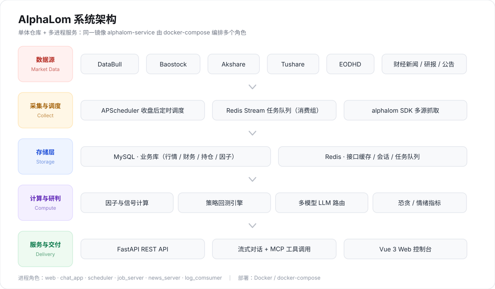
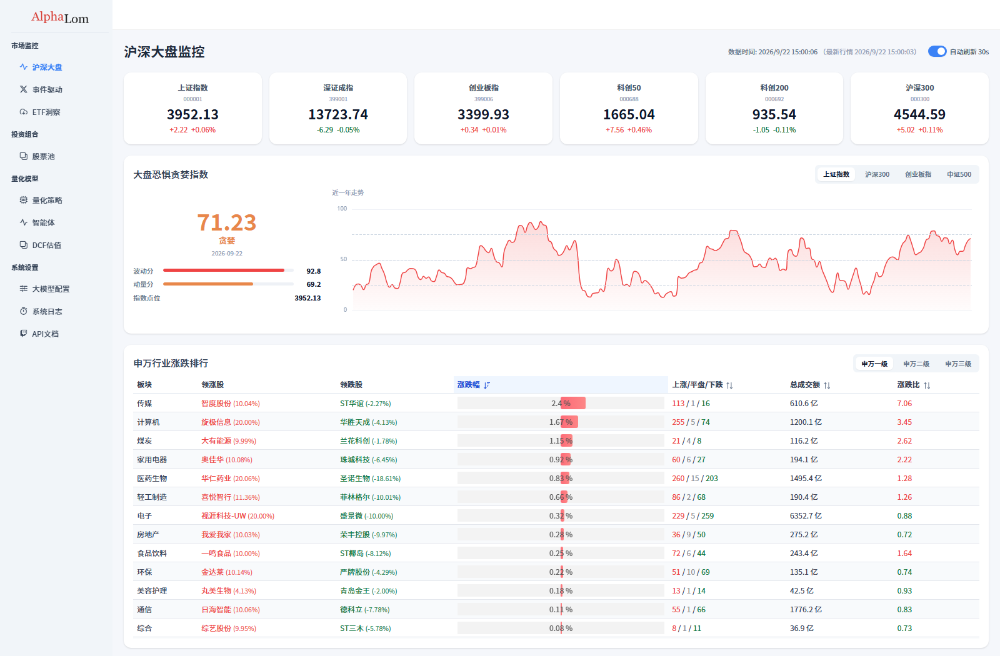
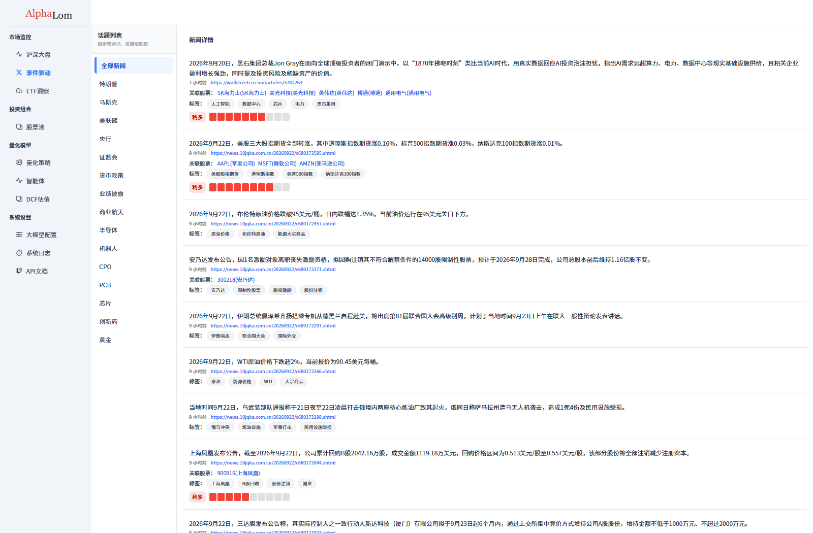
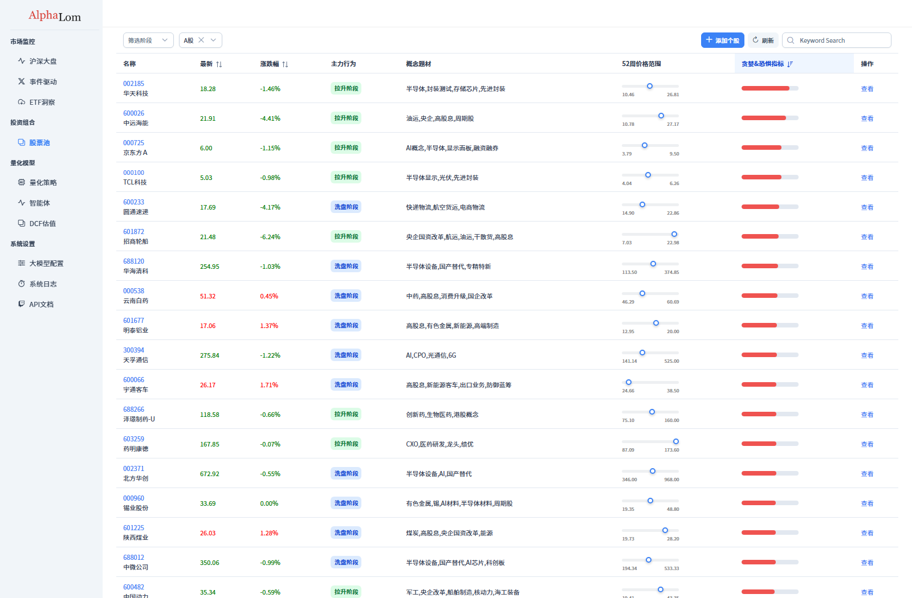
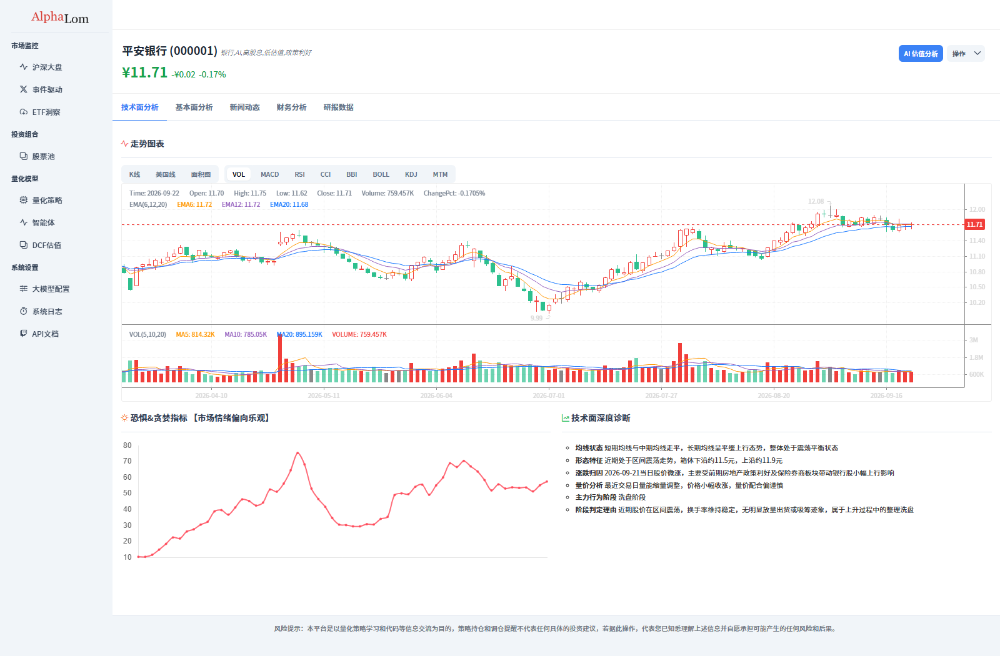
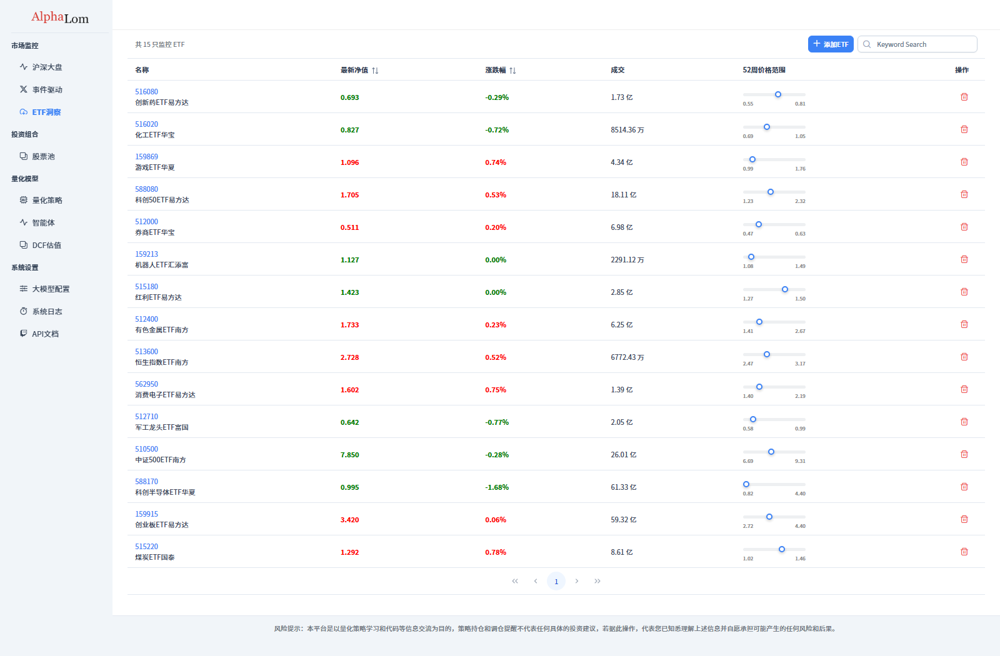
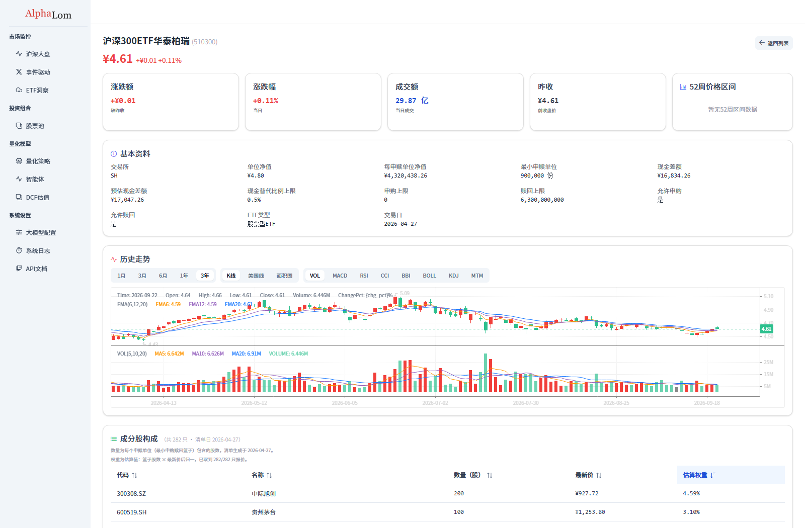

<div align="center">

<picture>
  <source media="(prefers-color-scheme: dark)" srcset="public/images/alphalom-logo-dark.png">
  
</picture>

### 一体化金融数据分析与智能投研平台

**以 Alpha（超额收益）为标的、以 Loom（织机）为喻**
把散落在行情、财务、新闻与另类数据中的市场信号，编织成可执行的投资决策。

[](#)
[](LICENSE)
[](#)
[](#)
[](#)
[](#)
[](#)
[](#)

</div>

---

## 📖 项目简介

AlphaLom 面向个人量化投资者与投研团队，提供从 **多源数据采集 → 因子与信号计算 → LLM 智能研判 → 投资组合管理 → 策略回测** 的全链路能力。

平台以 **REST API + Web 控制台** 双形态交付，原生集成多路大语言模型（DeepSeek、通义千问、豆包、智谱 GLM、SiliconFlow、MiniMax），把 LLM 的语义理解系统性地嵌进投研流程——财报解读、新闻情绪投票、量化策略代码生成、AI 辅助调仓。让机器读得懂市场，也让决策留得下痕迹。

## ✨ 功能特性

| | 模块 | 能力 |
|:--:|:--|:--|
| 📈 | **市场监控** | 沪深大盘指数与申万一级行业涨跌、板块情绪、市场温度计；事件驱动流按题材聚合全市场新闻，附关联个股、标签与多空情绪强度 |
| 🎯 | **个股监控** | 股票池支持关键字搜索添加（代码 / 名称双路联想）；个股详情整合 K 线与技术指标、主力行为阶段判定、恐贪指数、财务评分与 DCF 估值 |
| 🛰️ | **ETF 监控** | 监控清单持久化到数据库，支持搜索添加与删除；详情页含历史走势（K 线 + 量价指标）、基本资料、成分股穿透 |
| 💼 | **投资组合** | 组合总资产 / 仓位 / 浮动盈亏 / 夏普比率 / 最大回撤 / 年化收益，净值与收益走势曲线，交易复盘与 AI 调仓计划落库 |
| 🔁 | **量化策略与回测** | 多策略账户信号总览、回测参数设置、回测记录与逐笔明细、QuantStats 绩效报告 |
| 🧠 | **AI 分析** | 统一封装多路 LLM 按任务画像路由；自动生成研报、多模型新闻投票、策略代码生成，以及支持 MCP 工具调用的 AI 对话 |
| 🧩 | **数据接口** | 覆盖市场、股票、ETF、投资组合、回测五大域的 REST 接口，可直接对接第三方系统 |

## 🧱 系统架构



「单体仓库 + 多进程服务」：同一镜像 `alphalom-service` 由 `docker-compose.yaml` 编排启动多个角色。

| 服务 | 端口 | 入口 | 职责 |
|:--|:--|:--|:--|
| `web` | 8080 | `run_fastapi.py` | FastAPI REST API（主节点，静态资源 + SPA） |
| `chat_app` | 8082→8000 | `run_chat_app.py` | FastAPI 流式对话 + MCP |
| `scheduler` | — | `scheduler.py` | 收盘后数据 / 因子 / 信号调度 |
| `job_server` | — | `job/job_server.py` | Redis Stream 任务消费者（消费组） |
| `news_server` | — | `job/news_server.py` | 新闻聚合 |
| `log_comsumer` | — | `log_comsumer.py` | 日志消费 |

**后端模块**

- `app/` —— FastAPI 应用工厂、可信代理白名单、缓存策略、统一 JSON 响应
- `routes/`（8 个已注册路由器）· `service/`（25 个业务模块）· `llms/`（多模型封装）· `backtest/`（回测引擎与策略）
- `job/`（12 个离线任务）· `models/`（DB / Redis / 任务队列）· `utils/` · `prompts/`
- `alphalom/` —— 独立行情数据 SDK：股票 / ETF / 新闻多源抓取

**前端视图**（`src/views/`）：`market` · `stock` · `etf` · `portfolios` · `quant` · `ai` · `trading` · `user` · `system` · `auth` · `uikit`

## 🛠 技术栈

| 层次 | 选型 |
|:--|:--|
| 🎨 **前端** | Vue 3 · Vite · PrimeVue · Tailwind · klinecharts / ECharts · Monaco Editor |
| ⚙️ **后端** | Python 3.11+ · FastAPI · SQLAlchemy 2.0 · Pydantic 2 · uvicorn |
| 🗄️ **存储 / 中间件** | MySQL（业务库）· Redis（接口缓存 + 会话 + Stream 任务队列） |
| 🤖 **模型层** | DeepSeek · 通义千问 · 豆包（火山方舟）· 智谱 GLM · SiliconFlow · MiniMax |
| 📡 **数据源** | DataBull · Baostock · Akshare · Tushare · EODHD |
| 🚀 **调度 / 部署** | APScheduler · Docker / docker-compose |

## 🎯 关键设计

- **交易时段缓存**：盘前 / 盘中用正常缓存键，15:00–09:00（盘后）强制换 Key 回源，避免盘后行情被长期缓存。
- **多模型 LLM 路由**（`config.llm_model_setting`）：DCF → 火山方舟 `deepseek-v4-flash`；新闻 → 豆包 / 智谱多模型投票；对话 → DeepSeek `deepseek-v4-pro`。
- **定时调度**（`scheduler.py`，Asia/Shanghai）：16:15 回测、16:30 调仓（周日 20:30 补）；20:10 个股刷新 + 因子 + 信号、20:15 Beta、20:55 恐贪；周五 20:30 DCF 与基础评分。
- **并发模型**：绝大多数路由写成同步 `def`，由 anyio 线程池承接阻塞调用，从而拿到真并发；worker 数与线程池上限均配置化，不写死在代码里。
- **真实 IP**：`app/__init__.py` 维护可信代理白名单，仅信任来自可信代理的 `X-Forwarded-For`，防 IP 伪造。

## 📁 目录结构

```
alphalom/
├── run_fastapi.py        # FastAPI REST 入口
├── run_chat_app.py       # FastAPI 对话入口
├── scheduler.py          # 定时任务入口
├── log_comsumer.py       # 日志消费入口
├── config.py             # 全局配置（按 ENV 加载 .env / .env.<env>）
├── app/ routes/ service/ llms/ backtest/ job/ models/ utils/ prompts/ alphalom/
├── src/                  # Vue 前端源码
├── public/               # 静态资源（images/ 品牌资源、readme/ 截图与配图）
├── install/              # SQL 初始化脚本
├── dist/                 # 前端构建产物（由 FastAPI SPA 路由直接服务）
├── docker-compose.yaml   # 服务编排
├── Dockerfile
└── requirements.txt
```

## 🚀 快速开始

### 安装与配置

```bash
pip install -r requirements.txt
npm install
cp .env.sample .env       # 配置数据库 / Redis / 各 LLM API Key
```

`config.py` 在导入时按环境变量 `ENV` 加载对应文件：`ENV=production`（默认值之外）读 `.env`，其余读 `.env.<ENV>`（如 `.env.dev`），未找到时回退到进程已有的环境变量。

主要环境变量（详见 `config.py`）：`DATABASE_CONN_STR`、`REDIS_*`、`JOB_QUEUE_*`（任务队列 stream / 消费组名等）、`*_APIKEY`、`DATABULL_HOST`、`DATABULL_KEY`、`MCP_HOST`。

**并发配置**（见 `config.py` 的 `server_setting`）：

| 变量 | 默认 | 说明 |
|:--|:--|:--|
| `WEB_HOST` | `0.0.0.0` | 监听地址 |
| `WEB_PORT` | `8080` | 监听端口 |
| `WEB_WORKERS` | `1` | uvicorn 多进程 worker 数（每 worker 独立事件循环 + 线程池 + 连接池） |
| `WEB_THREAD_POOL_SIZE` | `40` | 单进程 anyio 线程池上限，即「同时执行的同步阻塞路由数」 |

> `WEB_THREAD_POOL_SIZE` 只约束同步 `def` 路由（本项目绝大多数路由是同步的，才能拿多线程并发）；纯 `async` 路由靠事件循环并发，不受其约束。调大前注意 DB 连接池容量：单进程最多 `pool_size + max_overflow = 80` 条连接，多 worker 时总连接数按倍数增长。

### 启动服务

```bash
python run_fastapi.py          # 主服务（FastAPI，dev 下自动热重载）
python run_chat_app.py         # AI 对话服务（独立进程，端口 8000）
python scheduler.py            # 定时调度
docker-compose up -d           # 或一键编排全部服务

npm run dev                    # Vite 开发服务器
npm run build                  # 构建到 dist/（由 FastAPI SPA 路由直接服务）
```

### Docker 构建与部署

`./docker.sh` 管理镜像与服务：`all` / `base` / `build` / `up` / `down` / `restart` / `status` / `logs` / `clean` / `help`。无参数运行默认「构建并启动」。

## 🖼 界面预览

<table>
<tr>
<td width="50%">

<b>沪深大盘监控</b><br>指数行情卡片 + 大盘恐惧贪婪指数 + 申万三级行业排行
</td>
<td width="50%">

<b>事件驱动</b><br>按题材聚合全市场新闻，附关联个股与多空情绪
</td>
</tr>
<tr>
<td width="50%">

<b>股票池（个股监控）</b><br>主力行为阶段、概念题材、52 周价格区间
</td>
<td width="50%">

<b>个股详情</b><br>K 线 + 技术指标、恐贪指数、技术面深度诊断
</td>
</tr>
<tr>
<td width="50%">

<b>ETF 洞察</b><br>监控清单可持久化，支持搜索添加与删除
</td>
<td width="50%">

<b>ETF 详情</b><br>历史走势、基本资料、申赎清单（PCF）成分股穿透
</td>
</tr>
</table>

> 以上截图取自真实运行的实例（沪深大盘 / 事件驱动 / 股票池 / 个股详情 / ETF 洞察 / ETF 详情），统一 1600×1050 取景。

## 👤 作者

**Yc** —— `yccheni@163.com`

## 📄 许可证

本项目基于 [Apache License 2.0](LICENSE) 开源。
